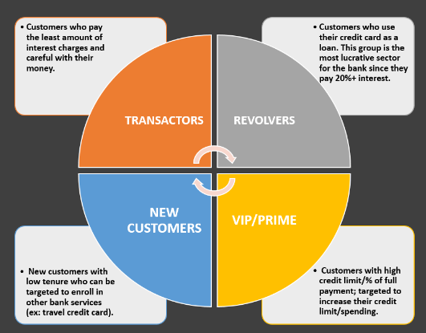

# Bank Customer Segmentation

## Description
This project implements unsupervised machine learning techniques for customer segmentation in a bank. It aims to classify customers into four distinct groups to help the bank's marketing team launch targeted ad campaigns.

## Problem Statement
The bank marketing team would like to leverage AI/ML to launch a targeted mareting ad campaign that is tailored to specific grop of customers.
This task is crucial for maximizing marketing campaign conversion rate.

## Solution
In order for this campaign to be successful, the bank has to divide it customers into at least 3 distinctive groups.
So, we going to divide the the customers into 4 distinctive groups as follows:
- First Customers cluster `Transactors`: Those are customers who pay least amount of intrerest charges and careful with their money, Cluster with lowest balance ($104) and cash advance ($303), Percentage of full payment = 23%
- Second customers cluster `revolvers` who use credit card as a loan (most lucrative sector): highest balance ($5000) and cash advance (~$5000), low purchase frequency, high cash advance frequency (0.5), high cash advance transactions (16) and low percentage of full payment (3%)
- Third customer cluster `VIP/Prime`: high credit limit $16K and highest percentage of full payment, target for increase credit limit and increase spending habits
- Fourth customer cluster `New Customers`: these are customers with low tenure (7 years), low balance 

we are going to apply K-Means algorithm (clustering) along with Principle Component Analysis (PCA) alogorithm.

## Usage
Install the required Python packages:
- `pandas==2.2.1`
- `numpy==1.26.4`
- `seaborn==0.13.2`
- `matplotlib==3.8.3`
- `scikit-learn==1.4.1`

## Dataset
The dataset used in this project is [Credit Card Dataset for Clustering](https://www.kaggle.com/datasets/arjunbhasin2013/ccdata). It includes the usage behavior of about 9000 active credit card holders during the last 6 months.